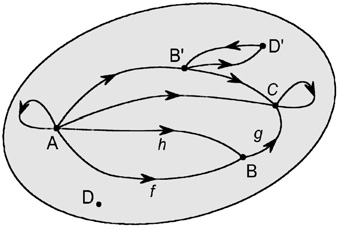
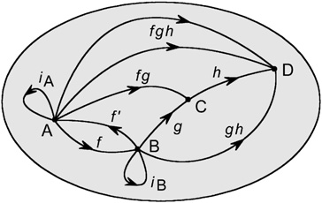
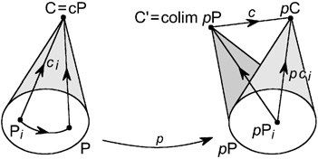
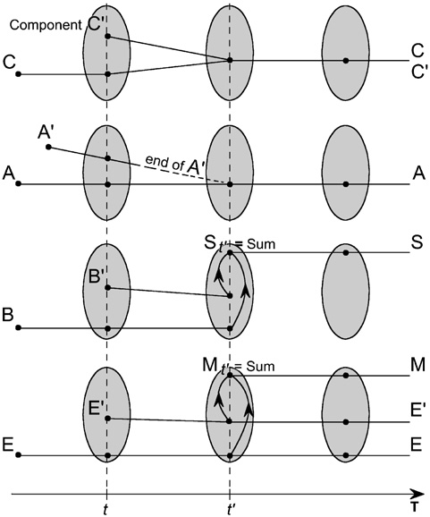
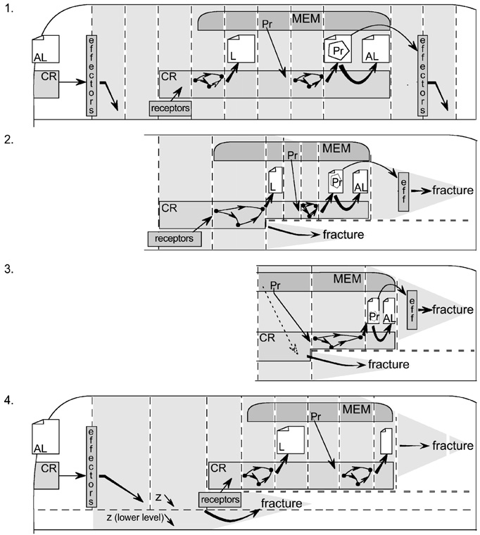
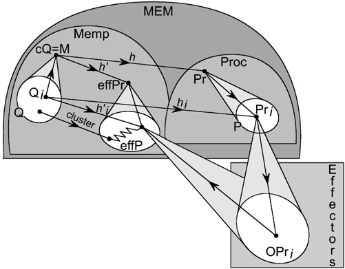
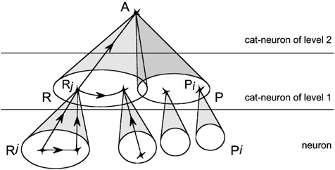
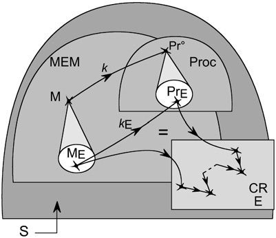
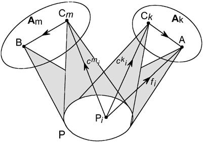

# MES07: Memory Evolutive Systems

## Overview
This foundational paper introduces Memory Evolutive Systems (MES) as mathematical models for autonomous evolutionary systems, particularly focusing on biological and social systems, including nervous systems of higher animals. The work is rooted in category theory and represents two decades of research development.

## Key Concepts

### Complexity Characterization
The paper addresses three fundamental problems:
1. **The Binding Problem**: How simple objects combine to form a "whole greater than the sum of its parts"
2. **The Emergence Problem**: How properties of complex objects relate to their elementary components
3. **The Hierarchy Problem**: Explaining the formation of increasingly complex objects, from elementary particles to societies

### Self-Regulation
The paper introduces key characteristics that allow for autonomy through self-regulation:
- Internal regulation systems
- Capacity to recognize environmental characteristics
- Development of appropriate responses
- Introduction of co-regulators (CR) for different hierarchy levels
- Flexible memory systems for adaptation

### Cognitive Systems
The paper explores applications to:
- Nervous system modeling
- Cognition processes
- Consciousness modeling
- Development of personal memory (archetypal core)

## Mathematical Framework
The model uses:
- Category theory as the foundational mathematical structure
- Complex systems theory
- Hierarchical evolutive systems based on colimit concepts
- Network theory for co-regulator interactions

## Applications
The framework has applications in:
- Biology
- Medicine
- Sociology
- Ecology
- Economics
- Complex systems analysis

## Historical Context
The work emerged from a collaboration between:
- Jean-Paul Vanbremeersch (physician specializing in gerontology)
- Andrée C. Ehresmann (mathematician)
Their collaboration began in 1980, leading to the development of MES theory.

## Figures and Captions
The paper contains detailed figures illustrating key concepts. Each figure is accompanied by a comprehensive caption explaining its significance.

### Chapter 1: Basic Concepts
The first chapter introduces fundamental mathematical concepts using visual representations:

*A graph. The vertices of the graph are represented by points, in this case A, B, B0, C, D and D0. The edges are represented by arrows such as f. Not all the arrows in the figure are labelled.*

*A path. A path of a graph G from vertex A to vertex B is a finite sequence of successive arrows of the graph, the first one beginning at A and the last ending at B.*

[Additional figures from Chapter 1...]

### Chapter 2: Patterns and Colimits
This chapter illustrates the mathematical structures used to model complex systems:

*A pattern. A pattern P in the category K is a homomorphism of graphs P from a graph sP (the "sketch" of the pattern) to K. The components of the pattern are the images of the vertices (indices) of sP under P.*

[Additional figures from Chapter 2...]

### Chapter 3: Links and Simple Links
Visual representations of relationships between components:

*P-factors of a link to cP. A link g from B to the colimit cP of the pattern P is mediated by the pattern P if it factors through a link gi from B to one of the components Pi of P. Such a link gi is called a P-factor of g (with respect to P).*

[Additional figures from Chapter 3...]

### Chapter 4: Functors and Complexification
Illustrations of mathematical transformations:

*Image of a pattern and of a collective link. p is a functor from K to K0. A pattern P in K has for its image by p a pattern pP in K0: it has the same sketch as P; the component of index i is the image pPi of the component Pi of P.*

[Additional figures from Chapter 4...]

### Chapter 5: Evolutive Systems
Visual representations of system evolution:

*Transition between two configurations. The evolutive system K admits T as its time scale and K_t for its configuration category at time t. The transition (partial) functor from K_t to the configuration category K_t' (at a later time t') identifies what each component at time t becomes at time t'.*

[Additional figures from Chapter 5...]

### Chapter 6: Memory Evolutive Systems
Illustrations of the core MES concepts:

*A schematic view of a memory evolutive system. A memory evolutive system (MES) is a hierarchical evolutive system, and the figure represents one of its configuration categories. Different sub-systems are distinguished.*

[Additional figures from Chapter 6...]

### Chapter 7: Aging and Dysfunction
Visual representations of system aging and failure modes:

*Different causes of fractures. Time is on the horizontal axis (left to right). (1) Regular step for the co-regulator, showing durations of the different phases. (2) A de-synchronization: the period d increases, causing a temporary misalignment that is later corrected.*

[Additional figures from Chapter 7...]

### Chapter 8: Memory and Learning
Illustrations of memory and learning processes:

*Formation of a record. An item S activates a pattern R of (internal or external) receptors. Only some of its components are observable in the landscape L_E of a particular co-regulator E, by the pattern r_E of their perspectives.*

[Additional figures from Chapter 8...]

### Chapter 9: Neural Systems
Visual representations of neural network concepts:

*Neurons and synapses. A neuron N is a cell of the neuronal system. It has two prolongations: an axon and a dendritic tree. Two neurons N and N0 are linked by synapses such as f, which connect the axon of one to the dendrite of the other.*

[Additional figures from Chapter 9...] 