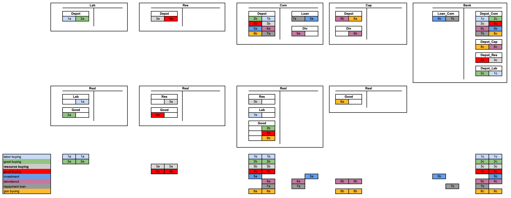

# Papers

This section provides an overview of the papers that form the theoretical foundation of the MoMa package.

## MoMa25: Monetary Macro Accounting
[Summary](moma25.md), [pdf](assets/moma25.pdf)

MoMa25 develops a specification for software for macro accounting (MoMa) and a monetary macro accounting theory (MoMaT). The paper presents a novel approach where money functions as a medium of payment for obligations and debts, rather than just a medium of exchange. It addresses temporal misalignment in production, legal principles of Separation and Abstraction, and debt management through a three-level system: micro (division of labor), meso (banking risk sharing), and macro (GDP distribution). The paper proposes and argues why to use mathematical tools including sheaf theory for accounting invariances, homology theory for monetary policy, and open games for computation, with applications in supply chain finance, monetary policy, renewable energy models, or digital currency development.

A MoMa Simulation in Julia of a National Accounting is in
`src/original_moma` directory contains several files used for generating and checking simulation data
underlying the MoMa paper. In file `momascf_v02_en.jl` is a simulation of the
following basic MoMa macro accounting structure.

 

## MES23: Human–Machine Interactions
[Summary](mes23.md), [pdf](assets/mes23.pdf)

MES23 applies the Memory Evolutive Systems framework to analyze human-machine interactions in complex systems. The paper explores how multiple agents with different temporalities can cooperate effectively, focusing on the synchronization and coordination challenges that arise in human-machine systems. It provides insights into designing more effective collaborative systems where humans and machines work together, taking into account their different processing speeds and decision-making capabilities.

## MES07: Memory Evolutive Systems
[Summary](mes07.md), [pdf](assets/mes07.pdf)

MES07 presents a comprehensive mathematical framework for modeling complex evolutionary systems using category theory. The paper introduces Memory Evolutive Systems (MES) as a theoretical foundation for understanding how biological, cognitive, and social systems develop and adapt over time. It explains how multiple hierarchical components interact and evolve, incorporating concepts such as emergence, complexity, and time-scaling. The framework is particularly valuable for modeling systems with multiple interconnected levels of organization, memory formation, and adaptive behavior.

A comprehensive synthesis of two decades of research on memory evolutive systems, presenting mathematical models for autonomous evolutionary systems such as biological, social, and nervous systems.