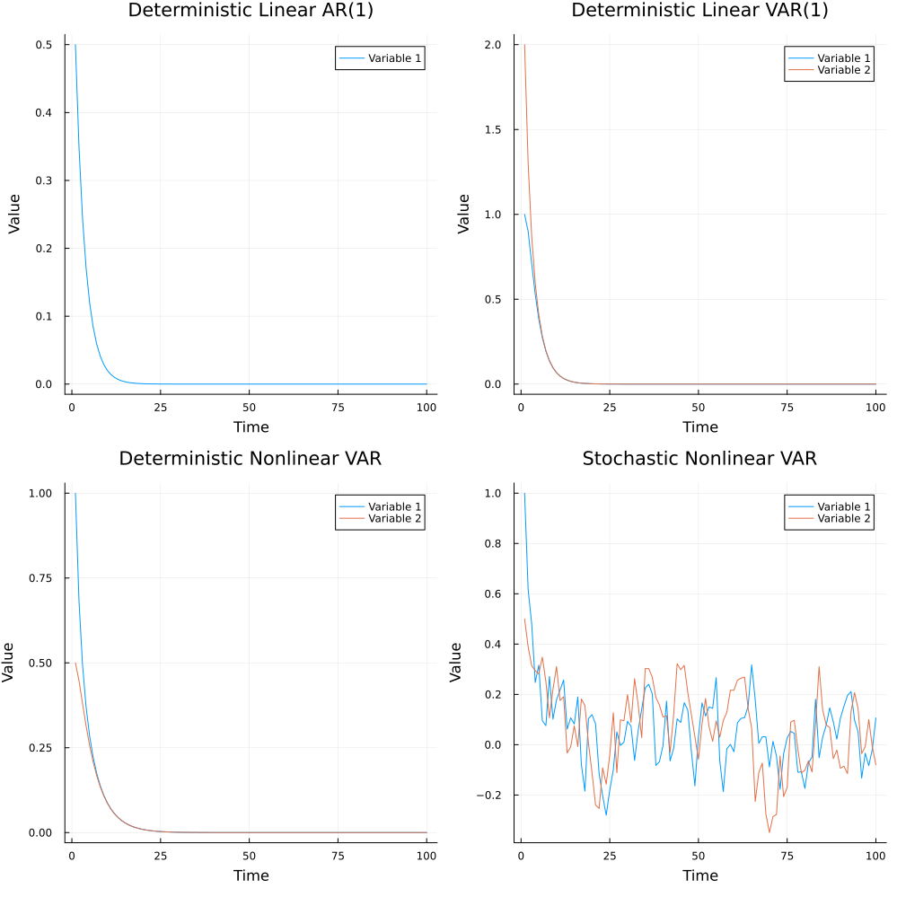

# State Space Model

We switch from functions to functors for state transitions, states become categories,
and use it for a monetary macro accounting (MoMa) then MES, ERP and EcRP.

A usual way to model dynamics of economic systems are state space models.
We will see now how to model them in MES to use them for a simple economics approach to model the MoMa phenomenon of money. This is the tranditional way we have implemented a first version of [MoMa25](papers.md) in simple Julia in file `momascf_v02_en.jl`. It is a deterministic nonlinear model but still reduced form model. Reduced form model is a economists way to say its a Markov decision process not even forward looking which would an economist call structural model. These forward lookings models can be modeled as Open Games but actually economic models should become MES systems where Open Games are coregulators.

## State Space Model as MES

Traditional state space models represent system dynamics as simple vector-valued functions mapping states to states. While this approach is intuitive and computationally efficient, it has several limitations:

1. **Limited Expressiveness**: Traditional state space models can only represent direct state-to-state mappings, making it difficult to model:
   - Complex hierarchical relationships
   - Multiple time scales
   - Emergent properties
   - Memory-dependent dynamics

2. **No Built-in Structure**: Standard state space models don't naturally capture:
   - System composition
   - Component relationships
   - Temporal dependencies
   - Memory formation

3. **Rigid Evolution**: Conventional models often struggle with:
   - Adaptive behavior
   - System reconfiguration
   - Emergent complexity
   - Multi-level interactions

The Memory Evolutive Systems (MES) framework, built on category theory, addresses these limitations by:

1. **Rich Mathematical Structure**:
   - Objects represent system components
   - Morphisms capture relationships and transformations
   - Categories organize system structure
   - Functors model system evolution

2. **Built-in Memory**:
   - Explicit representation of past states
   - Temporal ordering through categorical structure
   - Memory formation through colimits
   - Historical dependencies

3. **Flexible Composition**:
   - Hierarchical organization
   - Component relationships
   - System decomposition
   - Emergent properties

4. **Natural Evolution**:
   - Functorial dynamics
   - Adaptive behavior
   - System reconfiguration
   - Multi-level interactions

The following examples demonstrate these advantages in practice, showing how MES and category theory provide a more powerful framework for modeling complex dynamical systems.

## Memory

The `TimeSeriesMemory` type provides a structured way to store and manage time series data with explicit temporal relationships between states. It maintains three key components:

- `times`: Vector of time points
- `states`: Vector of state values
- `links`: Vector of morphisms connecting consecutive states

### Core Functions

```julia
# Create a new time series memory
TimeSeriesMemory(initial_time::Object{Float64}, initial_state::Object{T})

# Extend memory with new time point and state
extend!(memory::TimeSeriesMemory{T}, new_time::Object{Float64}, new_state::Object{T}, link::Morphism)

# Access memory components
get_data(memory::TimeSeriesMemory)::Vector{T}
get_times(memory::TimeSeriesMemory)::Vector{Float64}
get_links(memory::TimeSeriesMemory)::Vector{Morphism}
```

### Example

```julia
# Create initial memory
t₁ = Object(:t1, 1.0)
s₁ = Object(:s1, [1.0])
memory = TimeSeriesMemory(t₁, s₁)

# Verify initial state
@assert length(memory.times) == 1
@assert length(memory.states) == 1
@assert length(memory.links) == 0

# Extend memory with new state
t₂ = Object(:t2, 2.0)
s₂ = Object(:s2, [2.0])
link = Morphism(s₁, s₂, x -> 2.0 * x, :link)
extend!(memory, t₂, s₂, link)

# Verify extended state
@assert length(memory.times) == 2
@assert length(memory.states) == 2
@assert length(memory.links) == 1

# Access memory components
data = get_data(memory)
times = get_times(memory)
links = get_links(memory)

# Verify data types and values
@assert length(data) == 2
@assert length(times) == 2
@assert length(links) == 1
@assert all(x -> x isa Vector{Float64}, data)
@assert all(x -> x isa Float64, times)
@assert all(x -> x isa Morphism, links)
@assert data[1] == [1.0]
@assert data[2] == [2.0]
@assert times[1] == 1.0
@assert times[2] == 2.0
```

## AR(1) Model

The first-order autoregressive model represents a simple state space model where the next state depends linearly on the current state:

```math
x_{t+1} = \alpha x_t
```

where \(\alpha\) is the autoregression coefficient.

### Implementation

The AR(1) model is implemented using the following functions:

```julia
function create_ar_model(initial_state::Vector{Float64})
    t₁ = Object(:t1, 1.0)
    s₁ = Object(:s1, initial_state)

    time_step = Morphism(t₁, Object(:t2, 2.0), t -> t + 1.0, :time_step)
    evolution = Morphism(s₁, Object(:s2, [0.0]), x -> [0.7 * x[1]], :evolution)

    return t₁, s₁, time_step, evolution
end
```

This implementation uses category theory concepts:
- `Object`s represent time points and states
- `Morphism`s represent the evolution of time and states
- The time step morphism maps each time point to the next one
- The evolution morphism implements the AR(1) equation $x_{t+1} = \alpha x_t$ with $\alpha = 0.7$

### Example

```julia
# Create and simulate AR(1) model
t₁, s₁, time_step, evolution = create_ar_model([0.5])
memory = simulate_dynamics(t₁, s₁, time_step, evolution, 5)

# Verify the model behavior
@test s₁.data == [0.5]
@test time_step.map(1.0) == 2.0
@test evolution.map([0.5]) == [0.35]
```

## VAR(1) Model

The first-order vector autoregressive model extends the AR(1) model to multiple dimensions:

```math
\mathbf{x}_{t+1} = A\mathbf{x}_t
``` 

where \(A\) is the coefficient matrix and \(\mathbf{x}_t\) is a vector of states.

### Implementation

The VAR(1) model is implemented using:

```julia
function create_var_model(initial_state::Vector{Float64}, A::Matrix{Float64})
    t₁ = Object(:t1, 1.0)
    s₁ = Object(:s1, initial_state)

    time_step = Morphism(t₁, Object(:t2, 2.0), t -> t + 1.0, :time_step)
    evolution = Morphism(s₁, Object(:s2, similar(initial_state)), x -> A * x, :evolution)

    return t₁, s₁, time_step, evolution
end
```

This implementation extends the AR(1) model to multiple dimensions:
- Uses the same categorical structure with `Object`s and `Morphism`s
- The evolution morphism implements the VAR(1) equation $\mathbf{x}_{t+1} = A\mathbf{x}_t$
- Matrix multiplication is used to compute the next state vector

### Example

```julia
# Create and simulate VAR(1) model
A = [0.5 0.2; 0.1 0.6]
t₁, s₁, time_step, evolution = create_var_model([1.0, 2.0], A)
memory = simulate_dynamics(t₁, s₁, time_step, evolution, 100)

# Verify the model behavior
@test s₁.data == [1.0, 2.0]
@test evolution.map([1.0, 2.0]) .== A * [1.0, 2.0]
```

## Nonlinear VAR Model

The nonlinear VAR model introduces nonlinear transformations to the state evolution:

```math
\mathbf{x}_{t+1} = f(A\mathbf{x}_t)
```

where \(f\) is a nonlinear function applied element-wise.

### Implementation

The nonlinear VAR model is implemented using:

```julia
function create_nonlinear_var_model(initial_state::Vector{Float64}, A::Matrix{Float64})
    t₁ = Object(:t1, 1.0)
    s₁ = Object(:s1, initial_state)

    time_step = Morphism(t₁, Object(:t2, 2.0), t -> t + 1.0, :time_step)
    evolution = Morphism(s₁, Object(:s2, similar(initial_state)), x -> A * x + 0.1 * sin.(x), :evolution)

    return t₁, s₁, time_step, evolution
end
```

This implementation adds nonlinearity to the VAR model:
- Maintains the same categorical structure
- The evolution morphism combines linear transformation with nonlinear sine function
- The nonlinear term $0.1\sin(\mathbf{x})$ is applied element-wise to the state vector

### Example

```julia
# Create and simulate nonlinear VAR model
t₁, s₁, time_step, evolution = create_nonlinear_var_model([1.0, 0.5], A)
memory = simulate_dynamics(t₁, s₁, time_step, evolution, 100)

# Verify the model behavior
@test s₁.data == [1.0, 0.5]
@test evolution.map isa Function
result = evolution.map([1.0, 0.5])
@test length(result) == 2
@test all(isfinite, result)
```

## Stochastic Nonlinear VAR Model

The stochastic nonlinear VAR model adds random components to the state evolution:

```math
\mathbf{x}_{t+1} = f(A\mathbf{x}_t) + \boldsymbol{\epsilon}_t
```

where \(\boldsymbol{\epsilon}_t\) is a random noise vector.

### Implementation

The stochastic nonlinear VAR model is implemented using:

```julia
function create_stochastic_nonlinear_var_model(initial_state::Vector{Float64}, A::Matrix{Float64})
    t₁ = Object(:t1, 1.0)
    s₁ = Object(:s1, initial_state)

    time_step = Morphism(t₁, Object(:t2, 2.0), t -> t + 1.0, :time_step)
    evolution = Morphism(s₁, Object(:s2, similar(initial_state)), 
                        x -> A * x + 0.1 * sin.(x) + 0.1 * randn(length(x)), :evolution)

    return t₁, s₁, time_step, evolution
end
```

This implementation adds stochasticity to the nonlinear VAR model:
- Uses the same categorical structure
- The evolution morphism combines:
  - Linear transformation $A\mathbf{x}$
  - Nonlinear term $0.1\sin(\mathbf{x})$
  - Random noise $0.1\boldsymbol{\epsilon}$ where $\boldsymbol{\epsilon} \sim \mathcal{N}(0,1)$
- Each call to the evolution morphism produces a different result due to the random component

### Example

```julia
# Create and simulate stochastic nonlinear VAR model
t₁, s₁, time_step, evolution = create_stochastic_nonlinear_var_model([1.0, 0.5], A)
memory = simulate_dynamics(t₁, s₁, time_step, evolution, 100)

# Verify the model behavior
@test s₁.data == [1.0, 0.5]
@test evolution.map isa Function
results = [evolution.map([1.0, 0.5]) for _ in 1:10]
@test all(x -> length(x) == 2, results)
@test all(x -> all(isfinite, x), results)
@test length(unique(results)) > 1  # Ensure stochastic behavior
```

## Visualization

The state space models can be visualized using the following functions:

```julia
# Create time series plots for each model
p1 = plot_timeseries(ar1_memory, "Deterministic Linear AR(1)")
p2 = plot_timeseries(var1_memory, "Deterministic Linear VAR(1)")
p3 = plot_timeseries(nonlinear_memory, "Deterministic Nonlinear VAR")
p4 = plot_timeseries(stochastic_memory, "Stochastic Nonlinear VAR")

# Create comparison plot
comparison_plot = plot(p1, p2, p3, p4, layout=(2, 2), size=(1000, 1000))
savefig(comparison_plot, "dynamics_comparison.png")
```

This will generate a 2x2 grid of plots comparing the behavior of all four models, saved as "dynamics_comparison.png".



