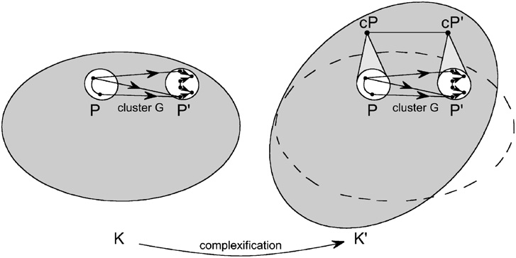
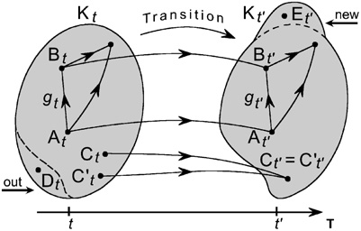
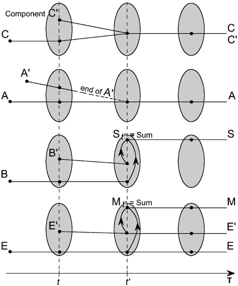
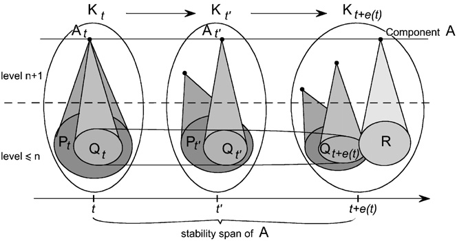

# Memory Evolutive Systems - Figures and Captions

## Chapter 1: Basic Concepts

### Figure 1.1

A graph. The vertices of the graph are represented by points, in this case A, B, B0, C, D and D0. The edges are represented by arrows such as f. Not all the arrows in the figure are labelled.

### Figure 1.2

A path. A path of a graph G from vertex A to vertex B is a finite sequence of successive arrows of the graph, the first one beginning at A and the last ending at B.

### Figure 1.3

A category. A category is a graph in which any two successive arrows have a composite; for example, the arrows f from A to B and g from B to C have a composite arrow fg from A to C (if such an arrow exists).

### Figure 1.4

Difference between a graph and a category. The first figure represents a graph which does not underlie a category, since the path (f, g) has no composite and there are no identities. This graph is included in a smallest category (represented in the central figure) obtained by adding a link h0 from A to C which becomes the composite fg of f and g, and identities for A, B and C.

### Figure 1.5

Commutative diagrams. Example of two simple commutative diagrams in a category. A commutative triangle has two successive arrows f and g and their composite h. A commutative square has two pairs of successive arrows f, g and f0, g0 such that fg = f0g0.

### Figure 1.6

Functors.

### Figure 1.7

A free object. We have a functor p from K to K0 and an object A0 of K0. The object A0 generates a free object, denoted by A, with respect to p if there is an arrow g0 from A0 to pA satisfying a universal property: for any arrow f0 from A0 to an object B in K0, there exists a unique arrow f from A to B in K such that f0 = p(f).

### Figure 1.8

The perception field. The (perception) field of the object A in the category K has for objects the arrows of K arriving to A (in the figure h, h0 and h00). An arrow k: h -> h0 from h to h0 is defined by a link k: C -> C0 in K such that (h, h0, k) form a commutative triangle.

### Figure 1.9

Operating field. For the category K depicted on the left, the operating field (depicted on the right) of A in K has for objects the links (in the figure f, f0, f00) from A to other objects in K, and its links, such as g: f -> f0, correspond to the commutative triangles with vertex A.

### Figure 1.10

The graph G of routes. The vertices of G are the seven cities A, A1, A2, …, A5, B, and its arrows represent the possible routes between them. G is a labelled graph, the weight of an arrow representing the length of that route (given in the figure for f1, f2, f3, f4).

### Figure 1.11

The category of paths. For the graph G of routes, the category P(G) of its paths has as arrows all the paths of G (the identity paths are not drawn). A path reduced to one arrow is identified with that arrow.

### Figure 1.12

The category of travel times. The category K of travel times shows the possible travel times between the cities. It is obtained from the category P(G) of Fig. 1.11 by identifying two paths between the same cities if they have equal total length, so that each equivalence class of paths (with the same length) becomes a single arrow in K.

### Figure 1.13

Categories associated to integers. The category associated to the integer n has the n+1 integers 0, 1, 2, …, n (≤ n) as its objects, and arrows corresponding to the natural order between these integers.

## Chapter 2: Patterns and Colimits

### Figure 2.1

A pattern. A pattern P in the category K is a homomorphism of graphs P from a graph sP (the "sketch" of the pattern) to K. The components of the pattern are the images of the vertices (indices) of sP under P.

### Figure 2.2

A collective link. A collective link from the pattern P to an object A in K consists of a link from every component of the pattern to A, these links being correlated by the distinguished links of the pattern.

### Figure 2.3

Role of the indices. The pattern P has four components, with indices 1, 2, 3, 4. The indices 1 and 3 have the same image B by P, while 2 and 4 have the same image B0.

### Figure 2.4

Colimit of a pattern. The given pattern P (its sketch is not shown) admits cP as its colimit, and (ci) is the collective binding link from P to cP. The universal property of the colimit ensures that any other collective link from P to an object X factors uniquely through cP.

### Figure 2.5

Comparison of the sum and the colimit. The pattern P admits both a sum (Sum) and a colimit (cP). We denote by (si) the collective binding link from the family (Pi) to its sum, and by (ci) the collective binding link from P to cP. The difference between Sum and cP (colimit) is illustrated by a comparison link c (dotted line) in the figure.

### Figure 2.6

Oxygenation of the haemoglobin tetramer. The curves represent the oxygenation fraction m as a function of the oxygen concentration [O2]. The dotted line is for the haemoglobin molecule, while the solid line is for the case where its four constituent monomers are separated.

## Chapter 3: Links and Simple Links

### Figure 3.1

P-factors of a link to cP. A link g from B to the colimit cP of the pattern P is mediated by the pattern P if it factors through a link gi from B to one of the components Pi of P. Such a link gi is called a P-factor of g (with respect to P).

### Figure 3.2

Links correlated by a zigzag. The zigzag of arrows from i to j in the sketch sP of the pattern P has for its image by P a zigzag of distinguished links of P. The links gi and gj from an object B to components Pi and Pj are correlated by such a zigzag of P.

### Figure 3.3

A perspective. Given an object B and a pattern P, a link gi from B to a component Pi of P is called an aspect of B for P. A perspective of B for P is a maximal set of aspects of B (links to various Pi) that are pairwise correlated by zigzags of distinguished links in P.

### Figure 3.4

A cluster between patterns. Given patterns Q and P, a cluster from Q to P is a maximal set of links from components of Q to components of P such that: (i) Each component Q_k of Q is connected to at least one component P_i of P by a link g_i. (If there are several such links from Q_k, they are correlated by a zigzag of distinguished links of P.) (ii) If a link g_j from Q to P is correlated by a zigzag to a link already in the cluster, then g_j is also in the cluster.

### Figure 3.5

Composition of clusters. The cluster G from pattern Q to P is composed with the cluster G0 from P to Q0. The composite cluster GG0 is generated by the composites of the links of G with those of G0. The figure shows why two such composites are well correlated by a zigzag of distinguished links of Q0.

### Figure 3.6

(Q, P)-simple link.

### Figure 3.7

Composition of simple links.

### Figure 3.8

Comparison between a pattern and its perspective.

### Figure 3.9

A representative sub-pattern.

### Figure 3.10

Connected patterns.

### Figure 3.11

Complex link.

### Figure 3.12

A hierarchical category.

### Figure 3.13

A ramification of length 2.

### Figure 3.14

Different ramifications.

### Figure 3.15

A reducible 2-iterated colimit.

## Chapter 4: Functors and Complexification

### Figure 4.1

Image of a pattern and of a collective link. p is a functor from K to K0. A pattern P in K has for its image by p a pattern pP in K0: it has the same sketch as P; the component of index i is the image pPi of the component Pi of P. A collective link (ci) from P to its colimit C in K has for image by p a collective link from pP to the image pC of C.

### Figure 4.2

Deformation of a colimit by a functor. The pattern P admits C as its colimit in K. The binding collective link (ci) from P to C has, for its image by the functor p, a collective link from the pattern pP to the image pC of C in K0. The comparison link c binds the collective link (ci) (image by p of the binding link from P to C) to the image pC of C, measuring how far p fails to preserve the colimit of P.

### Figure 4.3

Preservation of a colimit. We have a functor p from K to K0, and a pattern P which has a colimit C in K. We say that this colimit is preserved by the functor if the pattern pP (image of P by p) admits the image pC of C for its colimit in K0.

### Figure 4.4

Distributed link and limit of a pattern. A distributed link from an object B to the pattern P consists of links f_i from B to the components P_i of P, correlated by the distinguished links of the pattern. P has a limit lP (also called a classifier of P) if there exists an object lP and a particular distributed link (l_i) from lP to P, called the projection distributed link, through which any distributed link (f_i) from B to P is classified in a unique way into a link f from B to lP satisfying f_i = f l_i for each i.

### Figure 4.5

A pro-cluster. A pro-cluster from P to Q in a category K is a maximal set of links from components of P to components of Q such that: A component Q_k of Q is the target of at least one link from some component P_i of P (if there are multiple, they are correlated by a zigzag of distinguished links); and if a link from P to Q is correlated by distinguished links to another in the set, it is also included.

### Figure 4.6

Complexification with respect to an option. An option Op is given in K, and K0 is the category obtained by the complexification process in which the changes called for by the objectives of the option are implemented.

### Figure 4.7

Absorption and elimination. K0 is the complexification of K with respect to an option whose sole objectives are the absorption of the external graph U and the elimination of the objects included in a specified set V of objects of K. The complexification is what remains after these operations – namely, the full sub-category K0 of the sum having as objects the vertices of U and the objects of K not in V.

### Figure 4.8

Binding of patterns.

### Figure 4.9

Forcing of colimits.

### Figure 4.10

Construction of the simple links.

### Figure 4.11

Two successive complexifications.

### Figure 4.12

Emergent complex link.

## Chapter 5: Evolutive Systems

### Figure 5.1

Transition between two configurations. The evolutive system K admits T as its time scale and K_t for its configuration category at time t. The transition (partial) functor from K_t to the configuration category K_t' (at a later time t') identifies what each component at time t becomes at time t'.

### Figure 5.2

An evolutive system. The figure shows several successive configurations of an evolutive system K, beginning from an initial configuration at time t0. The transitions between the successive configurations are indicated (each transition is a partial functor between configuration categories K_t).

### Figure 5.3

Components of an evolutive system. A component consists of a maximal family of objects of successive configurations corresponding to each other through transitions over time. The component A has the configurations A_t in each K_t, linked by the transitions (so A_t transforms into A_t' under the transition functors for all successive time points t < t').

### Figure 5.4

Different interconnections between components. Two components of an evolutive system may interact over time. Several cases are shown in the figure. They may share some configurations (mix), or one's configuration may transform into another's (merge), etc., illustrating possible interconnections during the evolution.

### Figure 5.5

Stability span. At time t the component A of level n+1 is the colimit of the pattern P_t on the lower levels ≤ n, and also the colimit of another such pattern Q_t. The pattern P_t then varies with time, staying valid up to time t + ε(t). The stability span r(t) is the length of the time interval during which a component's internal organization (pattern) remains valid.

### Figure 5.6

Complex identity. Component A of level n+1 has an internal organization at lower levels, which is progressively modified: A admits a sequence (P_m) of decompositions, each one valid on a time interval [t_m, t_{m+1}). At each step, the component's identity changes as its internal structure changes, but we consider it the "same" component A through these successive modifications.

### Figure 5.7

Variations of the different spans. The figure shows diagrams for different temporal spans (renewal span, stability span, etc.) over the life cycle of a component. This can be compared with the cycle of the commercial life of a product.

### Figure 5.8

Fibration associated to an evolutive system.

## Chapter 6: Memory Evolutive Systems

### Figure 6.1

A schematic view of a memory evolutive system. A memory evolutive system (MES) is a hierarchical evolutive system, and the figure represents one of its configuration categories. Different sub-systems are distinguished. The receptors model components of the system which receive information from the environment or from internal states. The memory stores records of objects, behaviors, and experiences of any kind; these records can later be recalled in similar situations.

### Figure 6.2

Landscape of a co-regulator. The landscape of a co-regulator at a given time t is a formal model of the information about the system that the co-regulator can collect and decode during the first phase of its current step (lasting up to t+p).

### Figure 6.3

Selection of a procedure. During the second phase of a step (up to time t+m), the co-regulator selects the objectives to be carried out by choosing an admissible procedure (from its memory) through its landscape.

### Figure 6.4

Anticipated landscape. The commands of the admissible procedure Pr selected by the co-regulator on its landscape at time t are sent to effectors. The standard changes expected from the commands (the anticipated effects) are represented on an anticipated landscape.

### Figure 6.5

Evaluation. At the beginning of the next step, the anticipated landscape is compared with the actual landscape at time t+Δ. The partial functor "comparison" from the anticipated landscape to the new actual landscape indicates the discrepancies (errors) between expected and actual outcomes.

### Figure 6.6

Complete step of a co-regulator. The successive phases of the step of the co-regulator from t to t+Δ are shown: first the formation of the landscape, then selection of procedure, then execution/anticipation, then evaluation.

### Figure 6.7

Structural temporal constraints. The order of magnitude of the period d(t) must be greater than that of its time lag p(t) and of any propagation delays in its internal organization and selected procedure. If these temporal constraints fail to be satisfied, there is a fracture that might be repaired in the next step; if they fail for several steps, it leads to a dyschrony.

### Figure 6.8

A business enterprise. On the left, a memory evolutive system modeling a business enterprise is depicted, with the hierarchy of its co-regulators of different levels. On the right, the dynamics in their various landscapes are depicted, and the production phases are highlighted in the lower-level components (workshops) while planning phases are emphasized at higher managerial levels.

## Chapter 7: Aging and Dysfunction

### Figure 7.1

Different causes of fractures. Time is on the horizontal axis (left to right). (1) Regular step for the co-regulator, showing durations of the different phases. (2) A de-synchronization: the period d increases, causing a temporary misalignment that is later corrected. (3) A fracture: the time lag p increases too much, causing a break in synchronization. (4) A dyschrony: repeated fractures over several steps lead to chronic misalignment.

### Figure 7.2

Different types of dyschrony. Comparison, for a given co-regulator, of the evolution over time of the time lag p, the period d, and the minimum stability span ζ of the components involved in its procedure. Various cases of dyschrony are illustrated depending on how p, d, ζ change relative to each other over time.

### Figure 7.3

Interactions between two heterogeneous co-regulators. We have two co-regulators with different complexity levels; the higher-level one (macro-CR) has much longer steps than the lower-level one (micro-CR). During one macro-step from T1 to T2, there are many micro-steps from t1 to t2.

### Figure 7.4

Fractures and their repairs. Flowchart of the many possible outcomes from fractures in co-regulators interacting between and across levels. The pattern repeats at higher and lower levels. The possible consequences within a single co-regulator (self-repairs, compensation, etc.) and across co-regulators (assistance from higher-level, etc.) are shown.

### Figure 7.5

Aging curves. The curve of ζ/d as a function of time slowly approaches 1 during senescence, while the curve of ζ/p also approaches 1 but remains above the first curve. (Thus the system's period d and stability ζ decline with age, and eventually the time lag p catches up to them.)

### Figure 7.6

Pathology and recovery during aging. During a pathology, ζ/p may cross under ζ/d for a while (meaning the time lag exceeds stability span, causing dyschrony). For recovery, ζ/p must climb back above ζ/d, though both eventually decrease with age. Death will ensue if ζ/p remains below ζ/d for too long.

## Chapter 8: Memory and Learning

### Figure 8.1

Formation of a record. An item S activates a pattern R of (internal or external) receptors. Only some of its components are observable in the landscape L_E of a particular co-regulator E, by the pattern r_E of their perspectives. One of the next objectives of E will be to bind this pattern, in order to remember it.

### Figure 8.2

Procedural memory. The procedural memory Proc is an evolutive sub-system of the memory MEM of the MES, whose components are called procedures. Each procedure Pr has an associated pattern of commands OPr: its indices are links f from Pr to an effector OPr_f (a command of the procedure); each such link represents a command.

### Figure 8.3

Effector record of a limit of procedures. The procedure Pr is the limit of a pattern P of procedures, with projections d_i: Pr -> P_i. The commands of Pr unite those of the various P_i, meaning Pr's commands include all commands from each P_i. The colimit of the pattern of commands (OPr) of Pr is an effector record effPr.

### Figure 8.4

Activator link. M is the record of a situation S, and Pr a procedure which has been successfully used for responding to it; OPr is the pattern of commands of Pr. An activator link h from M to Pr is created when the procedure Pr is effective for situation S.

### Figure 8.5

Formation of a new procedure. A new situation is encountered, which activates a pattern Q of partial records Q_i each having an activator link h_i to a procedure Pr_i; let h0_i be the corresponding link from Q_i to effPr_i. We suppose that the Pr_i are the components of a pattern P of procedures and that the links h0_i generate a cluster from the pattern Q to the pattern effP.

### Figure 8.6

Storing of a procedure in the memory. The situation S activates its record M, which is the colimit of the pattern Q of its partial records. E is a co-regulator for which M has a partial record; E selects the procedure Pr_E in its landscape, through an activator link h_E from M_E to Pr_E.

### Figure 8.7

Formation of an E-concept. E is a co-regulator and M a record in the memory MEM. A subset of agents of E recognizes certain aspects β, β0 of M. These agents (indexed by the various aspects β) together activate a pattern of perspectives r_E of M for E.

### Figure 8.8

E-universal link from a record to its E-concept. M is a record having an E-concept C_M; the aspects of M recognized by E form a distributed link to its E-trace Tr_M, which is classified by a link m_0 from M to the limit C_M of Tr_M.

### Figure 8.9

The functor E-concept. M and N are records which have E-concepts, denoted by C_M and C_N, and f is a link in the memory MEM from M to N. Thus, C_M is the limit of the E-trace Tr_M of M and C_N is the limit of Tr_N.

### Figure 8.10

Colimit of E-concepts. M is a record which is the colimit of a pattern Q of records M_i. Then its E-concept C_M is the colimit of the pattern C_Q (the image of Q by the E-concept functor C). This means that if M is composed of smaller records M_i, the E-concept of M results from combining the E-concepts of the M_i.

## Chapter 9: Neural Systems

### Figure 9.1

Neurons and synapses. A neuron N is a cell of the neuronal system. It has two prolongations: an axon and a dendritic tree. Two neurons N and N0 are linked by synapses such as f, which connect the axon of one to the dendrite of the other.

### Figure 9.2

A synaptic path. A synaptic path is a sequence of consecutive synapses, joining N to N1, N1 to N2, …, and N_{m-1} to N_m. If the activity of the first neuron N is strong enough and there is no inhibition, a spike (signal) can propagate from N to N_m along this path, with each synapse transmitting to the next neuron.

[End of figures] 